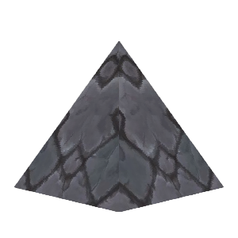
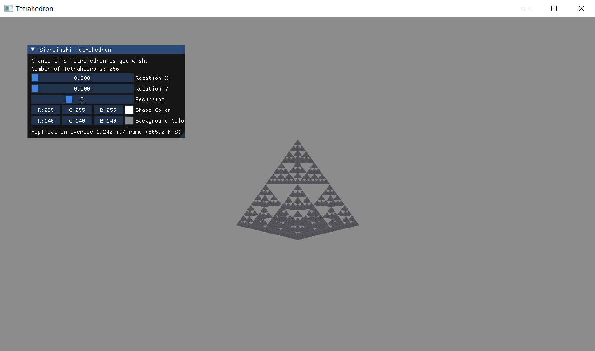

<div align='center'>
  
   
  <div id="toc">
    <ul style="list-style: none;">
      <summary>
        <h1>Tetrahedron Optimization 3.0</h1>
      </summary>
    </ul>
  </div>
</div>

Small project to test how many recursion levels of **Sierpiński Tetrahedron**, GPU can draw using OpenGL. This project is a personal experiment in real-time rendering and GPU optimization using OpenGL.



## 📚 Table of Contents

- [🚀 Features](#-features)  
- [🛠 Requirements](#-requirements)  
- [🔧 Build Instructions](#-build-instructions)  
- [📁 Project Structure](#-project-structure)  
- [🧠 Rendering & Optimization Techniques](#-rendering--optimization-techniques)  
- [📊 Performance Benchmark](#-performance-benchmark)  
- [📜 License](#-license)  
- [👤 Author](#-author)

## 🚀 Features

- 🔺 **Recursive Sierpiński Tetrahedron** (Recursion levels: 0–14)
- 🎨 Real-time background and object color customization
- 🌀 Interactive scene rotation (X / Y axes)
- 🖱️ Clean, minimal UI built with **Dear ImGui**
- ⚡ High-performance rendering using:
  - **Instancing**
  - **SSBO (Shader Storage Buffer Objects)**
  - **Geometry Shader-based rendering**
  - **Recursive generation from previous tetrahedrons**
  - **GPU buffer mapping with memory barriers (GLsync)**
  - **Data is sent to shaders only when changed**
- ✅ Fully compatible with **OpenGL 4.3+**

## 🛠 Requirements

- **C++17 or newer**
- **OpenGL 4.3+**
- Dependencies (via CPM.cmake or manual inclusion):
  - [GLFW](https://github.com/glfw/glfw)
  - [GLAD](https://glad.dav1d.de/)
  - [GLM](https://github.com/g-truc/glm)
  - [Dear ImGui](https://github.com/ocornut/imgui)
  - [spdlog](https://github.com/gabime/spdlog)
  - [freetype](https://github.com/freetype/freetype)
  - [stb_image](https://github.com/nothings/stb/blob/master/stb_image.h)

## 🔧 Build Instructions

### Step-by-step

```bash
git clone https://github.com/Muppetsg2/OpenGL_Tetrahedron_Optimization.git
cd OpenGL_Tetrahedron_Optimization
cmake -B build -DCMAKE_BUILD_TYPE=Release
cmake --build build --parallel
./build/OpenGL_Tetrahedron_Optimization
```
> NOTE for Windows 10/11 users:\
> Make sure Developer Mode is enabled in your system settings.\
> Go to: `Settings > Privacy & security > For developers > Developer Mode`

## 📁 Project Structure

```bash
├── cmake/                     # CMake utilities
│   ├── CPM.cmake              # CPM settings
│   └── global_settings.cmake  # CMake global settings
├── git_images/                # Images for Readme
├── res/                       # Resources
│   ├── shaders/
│   └── textures/
├── src/                       # Main application source
│   ├── CMakeLists.txt
│   ├── main.cpp
│   ├── pch.hpp
│   ├── Shader.cpp
│   ├── Shader.hpp
│   ├── Texture.cpp
│   └── Texture.hpp
├── thirdparty/                # External libraries
├── CMakeLists.txt
├── CMakeSettings.json
├── LICENSE
└── README.md
```

## 🧠 Rendering & Optimization Techniques

This project uses several GPU-friendly techniques to maintain real-time performance even at high recursion depths:

- **Instancing** – One draw call for thousands/millions of tetrahedrons.
- **Shader Storage Buffer Objects (SSBO)** – Store instance transformation data efficiently on the GPU.
- **Geometry Shader** – Dynamically constructs tetrahedron geometry from a single point per instance.
- **Recursive Construction** – New tetrahedrons are built from the output of the previous recursion level.
- **Mapped Buffer Updates** – Efficient CPU-to-GPU data transfer using glMapBufferRange.
- **GLsync and Memory Barriers** – Ensures safe access to GPU buffers across frames.
- **Delta Data Uploading** – Only update GPU buffers when instance data changes.

## 📊 Performance Benchmark

Frame rates measured at different recursion levels on multiple GPUs:
|            GPU           | Recursion 8 | Recursion 12 | Recursion 13 | Recursion 14 |
|--------------------------|-------------|--------------|--------------|--------------|
| NVIDIA RTX 3060 Laptop   |    ~1700 FPS|       ~76 FPS|       ~19 FPS|        ~3 FPS|
| NVIDIA RTX 4070 Ti SUPER |    ~1700 FPS|      ~130 FPS|       ~37 FPS|        ~9 FPS|

> ⚠️ Performance is affected by resolution, drivers, system load, and whether debug mode is enabled.

Number of tetrahedrons generated at each recursion level (`4^(r-1)`):
| Recursion Level | Number of Tetrahedrons |
|-----------------|------------------------|
|        8        |           16 384       |
|       12        |        4 194 304       |
|       13        |       16 777 216       |
|       14        |       67 108 864       |

> ℹ️ r — recursion level, where r = 0 means no object is rendered.

## ✨ Authors
👤 **Marceli Antosik (Muppetsg2)**

💡 If you have any questions or suggestions, feel free to contact me!


## 📜 License
📝 This project is **MIT Licensed**.

📖 **MIT License Overview:**
- ✅ Free to use, modify, and distribute.
- ✅ Can be used in **commercial** and **non-commercial** projects.
- ❗ Must include original license and copyright.

See the [LICENSE](./LICENSE) file for more details.
